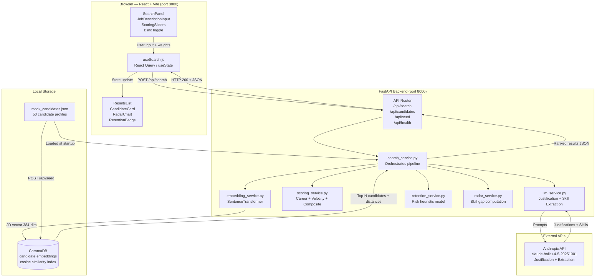

# Architecture.md — System Architecture
## Intelligent Candidate Discovery Engine
### India Runs Hackathon · Solo Sprint · 10-Day PoC

---

## 1. High-Level Architecture Flow



---

## 2. Data Flow — Single Search Request (Annotated)

```
[1] User submits JD + weights from browser
        │
        ▼
[2] useSearch.js → POST /api/search
    Body: { job_description, weights, top_n, blind_mode }
        │
        ▼
[3] FastAPI router → search_service.orchestrate_search()
        │
        ├──[3a] embedding_service.embed_jd(jd_text)
        │       → SentenceTransformer encodes JD to 384-dim vector
        │
        ├──[3b] chromadb.collection.query(jd_vector, n_results=top_n)
        │       → Returns: candidate_ids, distances, metadata
        │
        ├──[3c] For each returned candidate:
        │       ├── scoring_service.compute_career_score(candidate)
        │       ├── scoring_service.compute_velocity_score(candidate)
        │       ├── scoring_service.compute_composite(scores, weights)
        │       ├── retention_service.compute_retention_risk(candidate)
        │       └── radar_service.build_radar_data(candidate, jd_skills)
        │
        ├──[3d] asyncio.gather(*[
        │           llm_service.generate_justification(c, ...) for c in candidates
        │       ])
        │       → Parallel Haiku calls, one per candidate
        │
        ├──[3e] llm_service.extract_jd_skills(jd_text)
        │       → Single Haiku call, returns ["Python", "MLOps", ...]
        │
        └──[3f] Sort candidates by composite_score DESC
                Apply blind_mode masking if requested
                Return assembled SearchResponse
        │
        ▼
[4] React receives JSON → updates state → renders ResultsList
```

---

## 3. React Component Hierarchy

```
App.jsx
├── Header.jsx
│   ├── AppLogo.jsx
│   ├── AppTagline.jsx
│   └── HealthStatusDot.jsx          ← polls GET /api/health on mount
│
├── SearchPanel.jsx                   ← LEFT COLUMN
│   ├── JobDescriptionInput.jsx
│   │   ├── <textarea> with char counter
│   │   └── ValidationMessage.jsx
│   │
│   ├── ScoringSliders.jsx
│   │   ├── SliderRow.jsx × 3         ← one per: Semantic, Career, Velocity
│   │   └── WeightSumIndicator.jsx    ← shows "Total: 100%" validation
│   │
│   ├── SearchControls.jsx
│   │   ├── TopNSelector.jsx          ← radio group: 5 / 10 / 20
│   │   └── BlindModeToggle.jsx       ← styled toggle switch
│   │
│   └── SearchButton.jsx              ← disabled until weights sum to 100
│
├── ResultsPanel.jsx                  ← RIGHT COLUMN
│   ├── ResultsHeader.jsx
│   │   ├── ResultCount.jsx           ← "Showing 10 of 50 candidates"
│   │   ├── JdSkillTags.jsx           ← pill tags from jd_skills_extracted
│   │   ├── LatencyBadge.jsx          ← "Scanned in 1.2s"
│   │   └── ExportButton.jsx          ← downloads shortlist.json
│   │
│   ├── LoadingSkeleton.jsx           ← shows while awaiting API
│   │
│   ├── ErrorBanner.jsx               ← shows on API failure
│   │
│   └── ResultsList.jsx
│       └── CandidateCard.jsx × N     ← one per result
│           ├── CardHeader.jsx
│           │   ├── RankBadge.jsx
│           │   ├── CandidateAvatar.jsx
│           │   ├── CandidateIdentity.jsx   ← name/title/institution (blind-aware)
│           │   └── CompositeScoreBadge.jsx
│           │
│           ├── ScoreBreakdownBar.jsx  ← 3-segment Tailwind bar
│           │
│           ├── JustificationText.jsx  ← 2-sentence AI output
│           │
│           ├── RetentionBadge.jsx     ← LOW/MEDIUM/HIGH pill + tooltip
│           │
│           └── CandidateDetailPanel.jsx  ← expands on card click
│               ├── GapRadarChart.jsx  ← Recharts RadarChart
│               └── ProfileMetaGrid.jsx  ← tenure, companies, progression
│
└── hooks/
    ├── useSearch.js                   ← main search state + POST logic
    └── useHealthCheck.js              ← polls /api/health every 10s
```

---

## 4. Backend Module Structure

```
backend/
├── app/
│   ├── main.py                        ← FastAPI app init, CORS, router include
│   ├── router.py                      ← All route definitions
│   │
│   ├── services/
│   │   ├── search_service.py          ← Orchestrates full search pipeline
│   │   ├── embedding_service.py       ← SentenceTransformer load + encode
│   │   ├── scoring_service.py         ← compute_career, compute_velocity, compute_composite
│   │   ├── llm_service.py             ← Anthropic calls: justification + skill extract
│   │   ├── retention_service.py       ← Retention risk heuristic
│   │   └── radar_service.py           ← Radar data array construction
│   │
│   ├── models/
│   │   ├── request_models.py          ← Pydantic: SearchRequest, SeedRequest
│   │   └── response_models.py         ← Pydantic: SearchResponse, CandidateResult
│   │
│   ├── data/
│   │   └── mock_candidates.json       ← 50 candidate profiles (ground truth)
│   │
│   └── db/
│       └── chroma_client.py           ← ChromaDB init, get_or_create_collection
│
├── tests/
│   ├── test_scoring.py
│   └── test_search.py
│
└── requirements.txt
```

---

## 5. Frontend Folder Structure

```
frontend/
├── src/
│   ├── main.jsx                        ← ReactDOM.createRoot entry
│   ├── App.jsx                         ← Root layout: Header + two-column grid
│   │
│   ├── components/
│   │   ├── search/
│   │   │   ├── JobDescriptionInput.jsx
│   │   │   ├── ScoringSliders.jsx
│   │   │   ├── SliderRow.jsx
│   │   │   ├── SearchControls.jsx
│   │   │   ├── TopNSelector.jsx
│   │   │   ├── BlindModeToggle.jsx
│   │   │   └── SearchButton.jsx
│   │   │
│   │   ├── results/
│   │   │   ├── ResultsPanel.jsx
│   │   │   ├── ResultsHeader.jsx
│   │   │   ├── ResultsList.jsx
│   │   │   ├── JdSkillTags.jsx
│   │   │   ├── ExportButton.jsx
│   │   │   └── LatencyBadge.jsx
│   │   │
│   │   ├── candidate/
│   │   │   ├── CandidateCard.jsx
│   │   │   ├── CardHeader.jsx
│   │   │   ├── CandidateAvatar.jsx
│   │   │   ├── CandidateIdentity.jsx
│   │   │   ├── CompositeScoreBadge.jsx
│   │   │   ├── ScoreBreakdownBar.jsx
│   │   │   ├── JustificationText.jsx
│   │   │   ├── RetentionBadge.jsx
│   │   │   ├── CandidateDetailPanel.jsx
│   │   │   ├── GapRadarChart.jsx
│   │   │   └── ProfileMetaGrid.jsx
│   │   │
│   │   └── shared/
│   │       ├── Header.jsx
│   │       ├── HealthStatusDot.jsx
│   │       ├── LoadingSkeleton.jsx
│   │       ├── ErrorBanner.jsx
│   │       └── Tooltip.jsx
│   │
│   ├── hooks/
│   │   ├── useSearch.js
│   │   └── useHealthCheck.js
│   │
│   ├── utils/
│   │   ├── api.js                      ← fetch wrappers for all 4 endpoints
│   │   ├── formatters.js               ← score formatting, date helpers
│   │   └── blindMode.js                ← masking logic: name, institution, avatar
│   │
│   └── styles/
│       └── index.css                   ← Tailwind base directives + custom keyframes
│
├── public/
│   └── avatars/                        ← 50 placeholder avatar PNGs (c001.png–c050.png)
│
├── index.html
├── vite.config.js                      ← proxy /api → localhost:8000
├── tailwind.config.js
└── package.json
```

---

## 6. Key Architectural Decisions & Rationale

| Decision | Choice | Rationale |
|---|---|---|
| Vector DB | ChromaDB (local) | Zero-config, in-process, no Docker required; ideal for PoC |
| Embedding Model | all-MiniLM-L6-v2 | 384-dim, 80MB, runs on CPU in <200ms per encode |
| LLM | Anthropic claude-haiku-4-5-20251001 | Fastest + cheapest model, 2-sentence tasks need <150 tokens |
| Async LLM calls | `asyncio.gather()` | Parallel Haiku calls reduce wall-clock latency from 10s to ~2s for 10 candidates |
| State management | React `useState` + custom hooks | No Redux/Zustand needed for a single-feature PoC; less complexity |
| Blind mode | Frontend-only state | No new API call needed; all data always in response, UI conditionally renders |
| Scoring weights | Sent in every request | Stateless backend; no session needed; slider changes just re-POST |
| Chart library | Recharts | React-native, declarative, RadarChart built-in, 0 extra config |

---

## 7. Environment Variables

```bash
# backend/.env
ANTHROPIC_API_KEY=sk-ant-...
CHROMA_PERSIST_DIR=./chroma_data
MOCK_DATA_PATH=./app/data/mock_candidates.json
EMBEDDING_MODEL=all-MiniLM-L6-v2
PORT=8000

# frontend/.env
VITE_API_BASE_URL=http://localhost:8000
```

---

## 8. Startup Sequence

```bash
# Terminal 1 — Backend
cd backend
pip install -r requirements.txt
uvicorn app.main:app --reload --port 8000

# Terminal 2 — Seed ChromaDB (one-time, or after restart)
curl -X POST http://localhost:8000/api/seed

# Terminal 3 — Frontend
cd frontend
npm install
npm run dev
# → opens http://localhost:3000
```

FastAPI `main.py` should call `seed_if_empty()` on startup to auto-seed ChromaDB if the collection is empty, so the manual curl step is only needed for a full reset.
