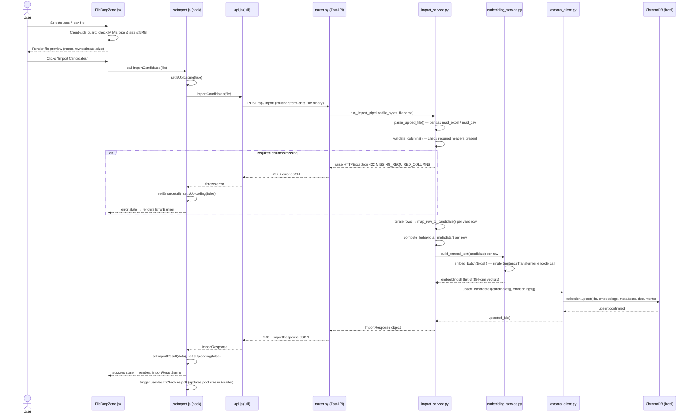

# Feature_Implementation.md
## Feature: Bulk Candidate Import via Excel / CSV Upload
### Intelligent Candidate Discovery Engine · India Runs Hackathon

---

## 1. Overview & Business Logic

### Feature Description

This feature adds a `POST /api/import` endpoint that accepts a multipart file upload (`.xlsx` or `.csv`) containing a structured candidate dataset, parses and validates each row using `pandas`, maps the tabular fields to the canonical `CandidateProfile` schema, computes all behavioral metadata heuristics inline, embeds each candidate's constructed text via `SentenceTransformer`, and injects the resulting vector + metadata into the live ChromaDB collection — all within a single synchronous request. The primary value proposition is converting the static 50-profile mock pool into a recruiter-controlled, dynamically expandable candidate database without requiring any backend restart or re-seed script.

### Target User Flow

- User navigates to a new **"Manage Pool"** tab in the left `SearchPanel`
- User sees the current candidate pool size (pulled from `GET /api/health`)
- User clicks **"Upload Candidates"** → a file input dialog opens (`.xlsx` / `.csv` accepted)
- User selects their spreadsheet file (max 5 MB, max 500 rows enforced client-side before upload)
- Frontend calls `POST /api/import` with `multipart/form-data`
- A localized loading state replaces the upload button: `"Importing 47 candidates..."`
- On success, a green success banner renders: `"47 candidates imported. Pool updated to 97 total."`
- `GET /api/health` is re-polled automatically; the `candidates_indexed` count updates in the header
- The **"Find Candidates"** button becomes active — the next search will query the enriched pool
- On failure (bad columns, oversized file, corrupt data), a red `ErrorBanner` renders the specific validation message returned by the backend; the existing pool is **not mutated**

---

## 2. Technical Architecture & Schemas

### 2.1 Data Contracts

#### Input: Required Spreadsheet Schema

The uploaded file must contain the following column headers **exactly** (case-insensitive, leading/trailing whitespace stripped during parsing). All columns marked `required` must be present for the file to be accepted; rows with missing `required` field values are skipped with a warning, not rejected wholesale.

| Column Header | Type | Required | Example Value | Notes |
|---|---|---|---|---|
| `candidate_id` | string | ✅ | `c051` | Must be unique. Collisions with existing IDs are resolved via upsert. |
| `full_name` | string | ✅ | `Priya Sharma` | Redacted in blind mode |
| `current_title` | string | ✅ | `Senior Data Scientist` | Used in embed text |
| `current_company` | string | ✅ | `Razorpay` | Metadata display only |
| `location` | string | ❌ | `Mumbai, India` | Defaults to `"India"` if missing |
| `years_experience` | float | ✅ | `5.5` | Used in `career_score` calculation |
| `skills` | string | ✅ | `"Python, SQL, Spark, dbt"` | Comma-separated. Min 1 skill required. |
| `project_1_title` | string | ✅ | `Churn Prediction Pipeline` | At least 1 project required |
| `project_1_description` | string | ✅ | `Built XGBoost model reducing churn by 18%` | Used in embed text + radar |
| `project_1_technologies` | string | ❌ | `"Python, XGBoost, Airflow"` | Comma-separated |
| `project_2_title` | string | ❌ | `Real-time Anomaly Detection` | Optional second project |
| `project_2_description` | string | ❌ | `Kafka + Flink pipeline for 10M events/day` | Used in embed text if present |
| `project_2_technologies` | string | ❌ | `"Kafka, Flink, Python"` | Comma-separated |
| `avg_tenure_months` | int | ✅ | `22` | Used in `retention_risk` heuristic |
| `num_companies_last_3yr` | int | ✅ | `2` | Used in `retention_risk` heuristic |
| `promotion_speed_months` | int | ✅ | `18` | Used in `velocity_score` |
| `title_progression_score` | float | ✅ | `7.5` | 0–10 scale, assigned manually by recruiter |
| `institution` | string | ❌ | `IIT Delhi` | Redacted in blind mode. Defaults to `"N/A"`. |
| `graduation_year` | int | ❌ | `2019` | Display only |
| `num_companies_total` | int | ❌ | `3` | Derived from career history if absent; defaults to `2` |

#### Output: `POST /api/import` Response Schema

```json
{
  "import_id": "uuid-string",
  "status": "success",
  "rows_received": 50,
  "rows_imported": 47,
  "rows_skipped": 3,
  "skip_reasons": [
    { "row": 12, "candidate_id": "c062", "reason": "Missing required field: current_title" },
    { "row": 28, "candidate_id": "c078", "reason": "years_experience must be a positive number" },
    { "row": 35, "candidate_id": null,   "reason": "Missing required field: candidate_id" }
  ],
  "pool_size_before": 50,
  "pool_size_after": 97,
  "upserted_ids": ["c051", "c052"],
  "processing_time_ms": 4210
}
```

#### Error Response Schema (4xx / 5xx)

```json
{
  "detail": "string — human-readable error message",
  "error_code": "INVALID_FILE_TYPE | FILE_TOO_LARGE | MISSING_REQUIRED_COLUMNS | EMPTY_FILE | PARSE_ERROR",
  "missing_columns": ["column_name_1", "column_name_2"]
}
```

---

### 2.2 Backend Component Updates

| File | Action | Functions to Add / Modify |
|---|---|---|
| `backend/app/router.py` | **Modify** | Add `POST /api/import` route; wire to `import_service` |
| `backend/app/services/import_service.py` | **Create (new file)** | `parse_upload_file()`, `validate_columns()`, `map_row_to_candidate()`, `compute_behavioral_metadata()`, `run_import_pipeline()` |
| `backend/app/services/embedding_service.py` | **Modify** | Extract `build_embed_text()` into a standalone importable function (currently inline in seed logic); `embed_batch()` for bulk encoding |
| `backend/app/db/chroma_client.py` | **Modify** | Add `upsert_candidates()` function using ChromaDB's `collection.upsert()` |
| `backend/app/models/request_models.py` | **Modify** | No new Pydantic model needed — FastAPI `UploadFile` handles multipart natively |
| `backend/app/models/response_models.py` | **Modify** | Add `ImportResponse` Pydantic model |
| `backend/app/data/mock_candidates.json` | **No change** | Existing seed data is untouched; import appends/upserts to the live collection |
| `backend/tests/test_import.py` | **Create (new file)** | Test cases per Section 4 |

---

### 2.3 Frontend Component Updates

| File | Action | State / Logic Notes |
|---|---|---|
| `frontend/src/components/search/SearchPanel.jsx` | **Modify** | Add tab switcher: `"Search"` (existing) \| `"Manage Pool"` (new). Controlled by `activeTab` useState. |
| `frontend/src/components/import/CandidateImportPanel.jsx` | **Create** | Houses the full import UI. Internal state: `file`, `isUploading`, `importResult`, `error`. |
| `frontend/src/components/import/FileDropZone.jsx` | **Create** | Drag-and-drop + click-to-browse input. Validates file type and size **client-side** before upload. |
| `frontend/src/components/import/ImportResultBanner.jsx` | **Create** | Renders success (green) or error (red) banner from `importResult` or `error` state. |
| `frontend/src/components/import/SkipReasonsList.jsx` | **Create** | Renders collapsible list of `skip_reasons` from the import response. |
| `frontend/src/components/import/PoolSizeIndicator.jsx` | **Create** | Reads `candidates_indexed` from the health check hook; re-polls after successful import. |
| `frontend/src/hooks/useImport.js` | **Create** | Encapsulates `FormData` construction, `fetch` call to `/api/import`, loading/error state management. |
| `frontend/src/utils/api.js` | **Modify** | Add `importCandidates(file: File): Promise<ImportResponse>` function. |

---

## 3. Step-by-Step Implementation Plan

### Sequence Diagram — Import Data Flow



---

### Phase 1: Preparation & Dependencies

- [ ] **`backend/requirements.txt`** — Add the following if not already present:
  ```
  pandas>=2.1.0
  openpyxl>=3.1.2
  python-multipart>=0.0.9
  ```
  > `python-multipart` is **required** by FastAPI to handle `UploadFile` / `multipart/form-data`. Without it, FastAPI raises a 422 silently on file upload routes.

- [ ] **`frontend/package.json`** — No new npm packages required. The feature uses native browser `fetch` with `FormData`, and existing Tailwind + Recharts cover the UI.

- [ ] **Verify** `sentence-transformers` is already installed (it is, per `TRD.md`). The `embed_batch()` function will use the already-loaded singleton model instance — no re-download.

- [ ] **Create** `backend/app/services/import_service.py` as a new empty file before writing any logic.

- [ ] **Create** `backend/tests/test_import.py` as a new empty file.

---

### Phase 2: Backend Development

#### Step 2.1 — Refactor `embedding_service.py`

- [ ] Extract the embed-text construction logic from the existing `seed` flow into a standalone `build_embed_text(candidate: dict) -> str` function at module level so both seed and import can import it without duplication:

```python
# backend/app/services/embedding_service.py  — ADD these functions

def build_embed_text(candidate: dict) -> str:
    """Constructs the string passed to the embedding model for a candidate."""
    skills = " ".join(candidate.get("skills", []))
    projects = " ".join([
        f"{p['title']} {p.get('description', '')} {' '.join(p.get('technologies', []))}"
        for p in candidate.get("projects", [])
    ])
    title = candidate.get("personal", {}).get("current_title", "")
    return f"{title} {skills} {projects}".strip()


def embed_batch(texts: list[str]) -> list[list[float]]:
    """
    Encodes a list of strings in a single SentenceTransformer call.
    Far more efficient than calling model.encode() in a loop.
    Returns a list of 384-dim float vectors.
    """
    if not texts:
        return []
    embeddings = _model.encode(texts, batch_size=32, show_progress_bar=False)
    return embeddings.tolist()
```

> `_model` refers to the module-level singleton: `_model = SentenceTransformer("all-MiniLM-L6-v2")` already initialized at module load.

#### Step 2.2 — Add `upsert_candidates()` to `chroma_client.py`

- [ ] Add the following function. ChromaDB's native `upsert` is idempotent on `id` — existing candidates with matching IDs are overwritten, new ones are inserted. This is the correct behavior for a re-import.

```python
# backend/app/db/chroma_client.py  — ADD this function

def upsert_candidates(
    candidate_ids: list[str],
    embeddings: list[list[float]],
    metadatas: list[dict],
    documents: list[str]
) -> list[str]:
    """
    Upserts candidates into ChromaDB.
    Existing IDs are overwritten; new IDs are inserted.
    Returns the list of upserted IDs.
    """
    collection = get_collection()  # existing helper that returns the "candidates" collection
    collection.upsert(
        ids=candidate_ids,
        embeddings=embeddings,
        metadatas=metadatas,
        documents=documents
    )
    return candidate_ids
```

#### Step 2.3 — Build `import_service.py`

- [ ] **Step 2.3a** — Implement file parsing with strict guards:

```python
# backend/app/services/import_service.py

import uuid
import time
import io
import pandas as pd
from fastapi import HTTPException

from app.services.embedding_service import build_embed_text, embed_batch
from app.db.chroma_client import upsert_candidates, get_collection

MAX_FILE_SIZE_BYTES = 5 * 1024 * 1024   # 5 MB hard limit
MAX_ROWS = 500

REQUIRED_COLUMNS = {
    "candidate_id", "full_name", "current_title", "current_company",
    "years_experience", "skills", "project_1_title", "project_1_description",
    "avg_tenure_months", "num_companies_last_3yr",
    "promotion_speed_months", "title_progression_score"
}

OPTIONAL_COLUMNS_DEFAULTS = {
    "location": "India",
    "institution": "N/A",
    "graduation_year": None,
    "num_companies_total": 2,
    "project_2_title": None,
    "project_2_description": None,
    "project_1_technologies": "",
    "project_2_technologies": "",
}


def parse_upload_file(file_bytes: bytes, filename: str) -> pd.DataFrame:
    """Parse raw bytes into a DataFrame. Raises HTTPException on failure."""
    if len(file_bytes) > MAX_FILE_SIZE_BYTES:
        raise HTTPException(
            status_code=413,
            detail={
                "detail": f"File exceeds 5 MB limit ({len(file_bytes) / 1024 / 1024:.1f} MB received).",
                "error_code": "FILE_TOO_LARGE"
            }
        )

    ext = filename.rsplit(".", 1)[-1].lower()
    if ext not in ("xlsx", "csv"):
        raise HTTPException(
            status_code=422,
            detail={"detail": f"Unsupported file type: .{ext}. Upload .xlsx or .csv only.", "error_code": "INVALID_FILE_TYPE"}
        )

    try:
        buf = io.BytesIO(file_bytes)
        if ext == "xlsx":
            df = pd.read_excel(buf, engine="openpyxl", dtype=str)
        else:
            df = pd.read_csv(buf, dtype=str)
    except Exception as e:
        raise HTTPException(
            status_code=422,
            detail={"detail": f"File could not be parsed: {str(e)}", "error_code": "PARSE_ERROR"}
        )

    if df.empty:
        raise HTTPException(
            status_code=422,
            detail={"detail": "Uploaded file contains no data rows.", "error_code": "EMPTY_FILE"}
        )

    # Normalize column names: lowercase + strip whitespace
    df.columns = [c.strip().lower().replace(" ", "_") for c in df.columns]
    return df
```

- [ ] **Step 2.3b** — Implement column validation:

```python
def validate_columns(df: pd.DataFrame) -> None:
    """Raises HTTPException 422 if any required column is absent."""
    present = set(df.columns)
    missing = REQUIRED_COLUMNS - present
    if missing:
        raise HTTPException(
            status_code=422,
            detail={
                "detail": f"Missing required columns: {', '.join(sorted(missing))}",
                "error_code": "MISSING_REQUIRED_COLUMNS",
                "missing_columns": sorted(list(missing))
            }
        )
```

- [ ] **Step 2.3c** — Row-level mapping with per-row error tolerance:

```python
def map_row_to_candidate(row: pd.Series, row_index: int) -> tuple[dict | None, dict | None]:
    """
    Maps a DataFrame row to a CandidateProfile dict.
    Returns (candidate_dict, None) on success.
    Returns (None, skip_reason_dict) if the row cannot be mapped.
    """
    def get(col, default=None):
        val = row.get(col, default)
        return default if pd.isna(val) else str(val).strip()

    candidate_id = get("candidate_id")
    if not candidate_id:
        return None, {"row": row_index, "candidate_id": None, "reason": "Missing required field: candidate_id"}

    current_title = get("current_title")
    if not current_title:
        return None, {"row": row_index, "candidate_id": candidate_id, "reason": "Missing required field: current_title"}

    try:
        years_exp = float(get("years_experience", "0"))
        if years_exp < 0:
            raise ValueError()
    except (ValueError, TypeError):
        return None, {"row": row_index, "candidate_id": candidate_id, "reason": "years_experience must be a positive number"}

    raw_skills = get("skills", "")
    skills = [s.strip() for s in raw_skills.split(",") if s.strip()]
    if not skills:
        return None, {"row": row_index, "candidate_id": candidate_id, "reason": "skills field is empty or unparseable"}

    projects = []
    for i in (1, 2):
        title = get(f"project_{i}_title")
        desc = get(f"project_{i}_description", "")
        if title:
            techs_raw = get(f"project_{i}_technologies", "")
            techs = [t.strip() for t in techs_raw.split(",") if t.strip()]
            projects.append({"title": title, "description": desc, "technologies": techs})
    if not projects:
        return None, {"row": row_index, "candidate_id": candidate_id, "reason": "At least one project (project_1_title) is required"}

    try:
        avg_tenure = int(float(get("avg_tenure_months", "18")))
        num_cos_3yr = int(float(get("num_companies_last_3yr", "2")))
        promo_speed = int(float(get("promotion_speed_months", "24")))
        title_prog = float(get("title_progression_score", "5.0"))
        num_cos_total = int(float(get("num_companies_total",
                                      str(OPTIONAL_COLUMNS_DEFAULTS["num_companies_total"]))))
    except (ValueError, TypeError) as e:
        return None, {"row": row_index, "candidate_id": candidate_id, "reason": f"Numeric field parse error: {str(e)}"}

    candidate = {
        "candidate_id": candidate_id,
        "personal": {
            "full_name": get("full_name", "Unknown"),
            "display_photo_url": f"/avatars/{candidate_id}.png",
            "current_title": current_title,
            "current_company": get("current_company", "Unknown"),
            "location": get("location", OPTIONAL_COLUMNS_DEFAULTS["location"]),
            "years_experience": years_exp,
        },
        "education": [{
            "institution": get("institution", OPTIONAL_COLUMNS_DEFAULTS["institution"]),
            "degree": "N/A",
            "graduation_year": get("graduation_year"),
        }],
        "skills": skills,
        "projects": projects,
        "behavioral_metadata": {
            "avg_tenure_months": avg_tenure,
            "num_companies_total": num_cos_total,
            "num_companies_last_3yr": num_cos_3yr,
            "promotion_speed_months": promo_speed,
            "title_progression_score": title_prog,
        }
    }
    return candidate, None
```

- [ ] **Step 2.3d** — Implement the main orchestration function:

```python
def run_import_pipeline(file_bytes: bytes, filename: str) -> dict:
    """
    Full synchronous import pipeline.
    Parses → validates → maps → embeds → upserts.
    Returns an ImportResponse-compatible dict.
    """
    start_time = time.monotonic()
    import_id = str(uuid.uuid4())

    # --- Parse & validate structure ---
    df = parse_upload_file(file_bytes, filename)
    validate_columns(df)

    # --- Enforce row limit ---
    if len(df) > MAX_ROWS:
        raise HTTPException(
            status_code=422,
            detail={
                "detail": f"File contains {len(df)} rows; maximum is {MAX_ROWS}.",
                "error_code": "FILE_TOO_LARGE"
            }
        )

    rows_received = len(df)

    # --- Row-level mapping (tolerant: bad rows are skipped) ---
    valid_candidates = []
    skip_reasons = []

    for idx, row in df.iterrows():
        candidate, skip = map_row_to_candidate(row, row_index=idx + 2)  # +2: 1-indexed + header row
        if candidate:
            valid_candidates.append(candidate)
        else:
            skip_reasons.append(skip)

    rows_imported = len(valid_candidates)

    if rows_imported == 0:
        raise HTTPException(
            status_code=422,
            detail={
                "detail": "No valid rows could be imported. Check skip_reasons for details.",
                "error_code": "PARSE_ERROR",
                "skip_reasons": skip_reasons
            }
        )

    # --- Snapshot pool size before upsert ---
    collection = get_collection()
    pool_size_before = collection.count()

    # --- Build embed texts and batch-encode ---
    embed_texts = [build_embed_text(c) for c in valid_candidates]
    embeddings = embed_batch(embed_texts)   # single model.encode() call for all rows

    # --- Prepare ChromaDB payload ---
    candidate_ids = [c["candidate_id"] for c in valid_candidates]

    # Metadatas: flat dict only (ChromaDB requirement — no nested dicts)
    metadatas = [{
        "full_name":              c["personal"]["full_name"],
        "current_title":          c["personal"]["current_title"],
        "current_company":        c["personal"]["current_company"],
        "location":               c["personal"]["location"],
        "years_experience":       c["personal"]["years_experience"],
        "institution":            c["education"][0]["institution"],
        "skills":                 ", ".join(c["skills"]),
        "avg_tenure_months":      c["behavioral_metadata"]["avg_tenure_months"],
        "num_companies_last_3yr": c["behavioral_metadata"]["num_companies_last_3yr"],
        "promotion_speed_months": c["behavioral_metadata"]["promotion_speed_months"],
        "title_progression_score":c["behavioral_metadata"]["title_progression_score"],
    } for c in valid_candidates]

    documents = embed_texts  # ChromaDB "documents" field = the raw text

    # --- Upsert into ChromaDB ---
    upserted_ids = upsert_candidates(candidate_ids, embeddings, metadatas, documents)

    pool_size_after = collection.count()
    elapsed_ms = int((time.monotonic() - start_time) * 1000)

    return {
        "import_id": import_id,
        "status": "success",
        "rows_received": rows_received,
        "rows_imported": rows_imported,
        "rows_skipped": len(skip_reasons),
        "skip_reasons": skip_reasons,
        "pool_size_before": pool_size_before,
        "pool_size_after": pool_size_after,
        "upserted_ids": upserted_ids,
        "processing_time_ms": elapsed_ms,
    }
```

> **Critical ChromaDB Constraint:** ChromaDB `metadata` values must be flat scalars (`str`, `int`, `float`, `bool`). Nested dicts or lists will raise a silent type error at upsert time. The `metadatas` construction above flattens all nested candidate fields accordingly. The full `CandidateProfile` JSON should be stored in the `search_service.py` in-memory dictionary (keyed by `candidate_id`) and loaded from `mock_candidates.json` + merged with import results at runtime, not in ChromaDB.

#### Step 2.4 — Add Route to `router.py`

- [ ] Add the import route. Use `UploadFile` — do **not** attempt to use a Pydantic model for file uploads:

```python
# backend/app/router.py  — ADD this route

from fastapi import APIRouter, UploadFile, File, HTTPException
from app.services.import_service import run_import_pipeline
from app.models.response_models import ImportResponse

router = APIRouter(prefix="/api")

@router.post("/import", response_model=ImportResponse)
async def import_candidates(file: UploadFile = File(...)):
    """
    Accepts a .xlsx or .csv file upload.
    Parses, validates, embeds, and upserts candidates into ChromaDB.
    Synchronous pipeline — no background workers.
    """
    ALLOWED_CONTENT_TYPES = {
        "application/vnd.openxmlformats-officedocument.spreadsheetml.sheet",
        "text/csv",
        "application/csv",
        "application/octet-stream",  # some OS/browsers send this for .xlsx
    }
    if file.content_type not in ALLOWED_CONTENT_TYPES and \
       not file.filename.endswith((".xlsx", ".csv")):
        raise HTTPException(
            status_code=422,
            detail={"detail": "Upload a .xlsx or .csv file.", "error_code": "INVALID_FILE_TYPE"}
        )

    file_bytes = await file.read()
    result = run_import_pipeline(file_bytes, file.filename)
    return result
```

#### Step 2.5 — Add `ImportResponse` to `response_models.py`

- [ ] Append the following Pydantic model:

```python
# backend/app/models/response_models.py  — ADD

from pydantic import BaseModel
from typing import Optional

class SkipReason(BaseModel):
    row: int
    candidate_id: Optional[str]
    reason: str

class ImportResponse(BaseModel):
    import_id: str
    status: str
    rows_received: int
    rows_imported: int
    rows_skipped: int
    skip_reasons: list[SkipReason]
    pool_size_before: int
    pool_size_after: int
    upserted_ids: list[str]
    processing_time_ms: int
```

---

### Phase 3: Frontend Integration

#### Step 3.1 — Add `importCandidates()` to `api.js`

- [ ] Add the following function. Note: `importCandidates` uses `FormData` — do **not** set `Content-Type` manually; the browser sets it with the correct `boundary` parameter automatically:

```javascript
// frontend/src/utils/api.js  — ADD

export async function importCandidates(file) {
  const formData = new FormData()
  formData.append('file', file)

  const response = await fetch(`${import.meta.env.VITE_API_BASE_URL}/api/import`, {
    method: 'POST',
    body: formData,
    // DO NOT set Content-Type header — browser sets multipart boundary automatically
  })

  const data = await response.json()
  if (!response.ok) {
    // Normalize FastAPI error shape into a consistent thrown Error
    const message = data?.detail?.detail || data?.detail || 'Import failed'
    const err = new Error(message)
    err.errorCode = data?.detail?.error_code || 'UNKNOWN'
    err.missingColumns = data?.detail?.missing_columns || []
    throw err
  }
  return data
}
```

#### Step 3.2 — Create `useImport.js` Hook

- [ ] Create `frontend/src/hooks/useImport.js`:

```javascript
// frontend/src/hooks/useImport.js

import { useState, useCallback } from 'react'
import { importCandidates } from '../utils/api'

export function useImport() {
  const [isUploading, setIsUploading] = useState(false)
  const [importResult, setImportResult] = useState(null)   // ImportResponse | null
  const [error, setError] = useState(null)                 // Error | null

  const runImport = useCallback(async (file) => {
    setIsUploading(true)
    setImportResult(null)
    setError(null)

    try {
      const result = await importCandidates(file)
      setImportResult(result)
    } catch (err) {
      setError(err)
    } finally {
      setIsUploading(false)
    }
  }, [])

  const reset = useCallback(() => {
    setImportResult(null)
    setError(null)
  }, [])

  return { isUploading, importResult, error, runImport, reset }
}
```

#### Step 3.3 — Create `FileDropZone.jsx`

- [ ] Create `frontend/src/components/import/FileDropZone.jsx`:

```jsx
// frontend/src/components/import/FileDropZone.jsx

import { useRef, useState } from 'react'

const MAX_SIZE_BYTES = 5 * 1024 * 1024  // 5 MB — mirrors backend guard

export function FileDropZone({ onFileSelected, isUploading }) {
  const inputRef = useRef(null)
  const [dragOver, setDragOver] = useState(false)
  const [clientError, setClientError] = useState(null)
  const [selectedFile, setSelectedFile] = useState(null)

  const handleFile = (file) => {
    setClientError(null)
    if (!file) return

    const ext = file.name.split('.').pop().toLowerCase()
    if (!['xlsx', 'csv'].includes(ext)) {
      setClientError('Only .xlsx and .csv files are accepted.')
      return
    }
    if (file.size > MAX_SIZE_BYTES) {
      setClientError(`File is too large (${(file.size / 1024 / 1024).toFixed(1)} MB). Maximum is 5 MB.`)
      return
    }
    setSelectedFile(file)
    onFileSelected(file)
  }

  return (
    <div
      onClick={() => inputRef.current?.click()}
      onDragOver={(e) => { e.preventDefault(); setDragOver(true) }}
      onDragLeave={() => setDragOver(false)}
      onDrop={(e) => { e.preventDefault(); setDragOver(false); handleFile(e.dataTransfer.files[0]) }}
      className={`relative border-2 border-dashed rounded-xl p-8 text-center cursor-pointer
        transition-all duration-200
        ${dragOver
          ? 'border-brand-primary bg-brand-primary/5'
          : 'border-surface-border hover:border-brand-primary/50 bg-surface-panel'
        }
        ${isUploading ? 'pointer-events-none opacity-60' : ''}`}
    >
      <input
        ref={inputRef}
        type="file"
        accept=".xlsx,.csv"
        className="hidden"
        onChange={(e) => handleFile(e.target.files[0])}
      />

      {!selectedFile ? (
        <>
          <p className="text-sm font-medium text-text-primary">
            Drop your spreadsheet here, or <span className="text-brand-primary">browse</span>
          </p>
          <p className="text-xs text-text-tertiary mt-1">.xlsx or .csv · Max 5 MB · Max 500 rows</p>
        </>
      ) : (
        <p className="text-sm font-medium text-text-primary">
          📄 {selectedFile.name}
          <span className="text-text-tertiary ml-2 font-mono text-xs">
            ({(selectedFile.size / 1024).toFixed(0)} KB)
          </span>
        </p>
      )}

      {clientError && (
        <p className="text-xs text-state-error mt-2">{clientError}</p>
      )}
    </div>
  )
}
```

#### Step 3.4 — Create `CandidateImportPanel.jsx`

- [ ] Create `frontend/src/components/import/CandidateImportPanel.jsx`:

```jsx
// frontend/src/components/import/CandidateImportPanel.jsx

import { useImport } from '../../hooks/useImport'
import { FileDropZone } from './FileDropZone'
import { ImportResultBanner } from './ImportResultBanner'
import { SkipReasonsList } from './SkipReasonsList'

export function CandidateImportPanel({ onImportSuccess }) {
  const { isUploading, importResult, error, runImport, reset } = useImport()

  const handleFileSelected = (file) => {
    reset()
    runImport(file).then(() => {
      if (onImportSuccess) onImportSuccess()  // triggers useHealthCheck re-poll in parent
    })
  }

  return (
    <div className="flex flex-col gap-4 p-4">
      <div>
        <p className="text-xs font-semibold uppercase tracking-widest text-text-tertiary mb-3">
          Import Candidate Pool
        </p>
        <FileDropZone onFileSelected={handleFileSelected} isUploading={isUploading} />
      </div>

      {isUploading && (
        <div className="flex items-center gap-2 text-sm text-text-secondary">
          <span className="w-4 h-4 border-2 border-brand-primary border-t-transparent 
            rounded-full animate-spin" />
          Processing file...
        </div>
      )}

      {(importResult || error) && (
        <ImportResultBanner result={importResult} error={error} />
      )}

      {importResult?.skip_reasons?.length > 0 && (
        <SkipReasonsList reasons={importResult.skip_reasons} />
      )}
    </div>
  )
}
```

#### Step 3.5 — Create `ImportResultBanner.jsx`

- [ ] Create `frontend/src/components/import/ImportResultBanner.jsx`:

```jsx
// frontend/src/components/import/ImportResultBanner.jsx

export function ImportResultBanner({ result, error }) {
  if (error) {
    return (
      <div className="rounded-xl p-4 bg-state-error/10 border border-state-error/20">
        <p className="text-sm font-semibold text-state-error">Import Failed</p>
        <p className="text-xs text-text-secondary mt-1">{error.message}</p>
        {error.missingColumns?.length > 0 && (
          <p className="text-xs text-text-tertiary mt-1 font-mono">
            Missing: {error.missingColumns.join(', ')}
          </p>
        )}
      </div>
    )
  }

  if (result) {
    return (
      <div className="rounded-xl p-4 bg-state-success/10 border border-state-success/20">
        <p className="text-sm font-semibold text-state-success">
          {result.rows_imported} candidate{result.rows_imported !== 1 ? 's' : ''} imported
        </p>
        <p className="text-xs text-text-secondary mt-1">
          Pool updated: {result.pool_size_before} → {result.pool_size_after} total
          {result.rows_skipped > 0 && ` · ${result.rows_skipped} row${result.rows_skipped !== 1 ? 's' : ''} skipped`}
        </p>
        <p className="text-xs text-text-tertiary mt-0.5 font-mono">
          Processed in {result.processing_time_ms}ms
        </p>
      </div>
    )
  }

  return null
}
```

#### Step 3.6 — Modify `SearchPanel.jsx` to Add Tab Switcher

- [ ] Add the `activeTab` state and tab switcher UI to the top of `SearchPanel.jsx`:

```jsx
// frontend/src/components/search/SearchPanel.jsx  — MODIFY

import { useState } from 'react'
import { CandidateImportPanel } from '../import/CandidateImportPanel'
// ... existing imports ...

export function SearchPanel() {
  const [activeTab, setActiveTab] = useState('search')  // 'search' | 'import'
  // ... existing state ...

  return (
    <div className="flex flex-col h-full">
      {/* Tab Switcher */}
      <div className="flex border-b border-surface-border">
        {['search', 'import'].map((tab) => (
          <button
            key={tab}
            onClick={() => setActiveTab(tab)}
            className={`flex-1 py-3 text-xs font-semibold uppercase tracking-widest
              transition-colors duration-150
              ${activeTab === tab
                ? 'text-brand-primary border-b-2 border-brand-primary'
                : 'text-text-tertiary hover:text-text-secondary'
              }`}
          >
            {tab === 'search' ? 'Search' : 'Manage Pool'}
          </button>
        ))}
      </div>

      {/* Tab Content */}
      <div className="flex-1 overflow-y-auto">
        {activeTab === 'search' && (
          // ... existing SearchPanel content (JD input, sliders, etc.) ...
          <ExistingSearchContent />
        )}
        {activeTab === 'import' && (
          <CandidateImportPanel onImportSuccess={() => {
            // Force re-poll of /api/health to refresh pool size in Header
            // useHealthCheck exposes a `refetch` function; wire accordingly
          }} />
        )}
      </div>
    </div>
  )
}
```

---

### Phase 4: Edge Cases & Error Handling

| Scenario | Backend Behavior | Frontend Behavior |
|---|---|---|
| File > 5 MB | `parse_upload_file()` raises HTTP 413 before pandas is invoked | `FileDropZone` blocks upload client-side; backend is second line of defense |
| Wrong file extension | HTTP 422 `INVALID_FILE_TYPE` immediately in route handler | `FileDropZone` accepts only `.xlsx,.csv` via `accept` attribute |
| Missing required columns | HTTP 422 `MISSING_REQUIRED_COLUMNS` with `missing_columns` list | `ImportResultBanner` renders column names in monospace |
| All rows fail validation | HTTP 422 `PARSE_ERROR` after row mapping loop | Same error banner; user can download a corrected template |
| Duplicate `candidate_id` in same file | Last occurrence wins (DataFrame iterates top-to-bottom; ChromaDB upsert overwrites) | No special UI — transparent behavior |
| `candidate_id` already in ChromaDB | `collection.upsert()` overwrites existing vector + metadata | `ImportResultBanner` shows `upserted_ids` list |
| Numeric field is non-numeric string | `map_row_to_candidate()` catches `ValueError`, appends to `skip_reasons` | `SkipReasonsList` shows affected rows |
| > 500 rows | HTTP 422 before embedding begins; avoids CPU spike from batch encode | Client-side row estimate shown in `FileDropZone` file preview |
| Corrupt Excel binary (truncated) | `pd.read_excel()` raises `Exception`; caught and re-raised as HTTP 422 `PARSE_ERROR` | `ImportResultBanner` renders `"File could not be parsed"` |
| ChromaDB collection not initialized | `get_collection()` raises; caught by FastAPI global exception handler; returns HTTP 503 | `ErrorBanner` (existing component) renders alongside import panel |
| Network timeout during upload | Browser `fetch` rejects promise | `useImport.js` catches in `catch(err)`, sets `error` state |
| Empty CSV (header row only) | `df.empty` check raises HTTP 422 `EMPTY_FILE` | `ImportResultBanner` renders `"Uploaded file contains no data rows"` |

---

## 4. Testing & Validation Plan

### Test Case 1 — Happy Path: Valid 20-row XLSX

**File:** `test_valid_20_candidates.xlsx` — 20 rows, all required columns present, all numeric fields valid, two unique companies per candidate, mix of LOW/MEDIUM/HIGH retention profiles.

**Steps:**
1. `curl -X POST http://localhost:8000/api/import -F "file=@test_valid_20_candidates.xlsx"`
2. Assert response `status == "success"`
3. Assert `rows_imported == 20`, `rows_skipped == 0`
4. Assert `pool_size_after == pool_size_before + 20`
5. Immediately call `POST /api/search` with a relevant JD; assert the new candidates appear in results

**Pass Criteria:** All 5 assertions pass. New candidates are discoverable via search with correct scores.

---

### Test Case 2 — Corrupted File / Wrong Type

**File A:** `corrupted.xlsx` — valid extension, binary content replaced with random bytes.  
**File B:** `resume.pdf` — wrong extension entirely.  
**File C:** `candidates.xlsx` renamed to `candidates.txt`.

**Steps:**
1. Upload File A → assert HTTP 422, `error_code == "PARSE_ERROR"`, message contains `"could not be parsed"`
2. Upload File B → assert HTTP 422, `error_code == "INVALID_FILE_TYPE"`
3. Upload File C → assert HTTP 422, `error_code == "INVALID_FILE_TYPE"` (extension check, not MIME)
4. After each upload, call `GET /api/health` → assert `candidates_indexed` is **unchanged**

**Pass Criteria:** All three files return 422. Pool is not mutated by any failed import.

---

### Test Case 3 — Missing Required Columns

**File:** `missing_columns.csv` — valid CSV but with `skills` and `promotion_speed_months` columns removed entirely.

**Steps:**
1. Upload file → assert HTTP 422, `error_code == "MISSING_REQUIRED_COLUMNS"`
2. Assert response body contains `"missing_columns": ["promotion_speed_months", "skills"]`
3. Verify frontend renders both column names in the `ImportResultBanner` monospace list

**Pass Criteria:** Backend identifies exact missing columns. Frontend displays them. No partial import occurs.

---

### Test Case 4 — Mixed Valid/Invalid Rows (Partial Import)

**File:** `mixed_50_rows.xlsx` — 50 rows total:
- Rows 1–45: valid
- Row 18: `years_experience = "not_a_number"`
- Row 33: `current_title` column present but cell is empty
- Row 47: `candidate_id` cell is empty
- Row 50: `skills` = `",,,"` (all empty after split)

**Steps:**
1. Upload file → assert HTTP 200
2. Assert `rows_received == 50`, `rows_imported == 46`, `rows_skipped == 4`
3. Assert `skip_reasons` array has exactly 4 entries with correct `row` numbers (19, 34, 48, 51 — accounting for header row offset) and descriptive `reason` strings
4. Call `POST /api/search` → confirm valid 46 candidates are retrievable

**Pass Criteria:** 46 rows imported, 4 skipped with accurate row-level diagnostics. `SkipReasonsList` renders all 4 in the UI.

---

## 5. Validation Checklist

Review each question before writing the first line of code:

- [ ] **1. Does the API response schema exactly match the frontend's expected state shape?**  
  Verify that `ImportResponse` in `response_models.py` and the TypeScript-equivalent shape consumed by `useImport.js` are in exact field-name and type alignment. Specifically confirm: `skip_reasons[].row` is `int` (not `str`), `upserted_ids` is `string[]`, and `pool_size_before` / `pool_size_after` are `int` (not `float`). The `SkipReasonsList` component maps over `skip_reasons` and accesses `.row`, `.candidate_id`, and `.reason` — all three must be present in every object, even if `candidate_id` is `null`.

- [ ] **2. Are all new dependencies accounted for in the deployment pipeline?**  
  Confirm `python-multipart` is in `requirements.txt` — it is the single most commonly forgotten FastAPI dependency for file upload routes and will cause all `POST /api/import` calls to silently return 422 without it. Confirm `openpyxl` is pinned to `>=3.1.2` to avoid the security-patched `.xlsx` parsing regression in `3.0.x`. No new npm packages are required.

- [ ] **3. Have all potential synchronous blocking operations been safeguarded with timeouts or file-size limits?**  
  The two blocking operations in the synchronous pipeline are: (a) `embed_batch()` — bounded by `MAX_ROWS = 500`; at ~0.5ms per embed on CPU, 500 rows takes ~250ms, well within a 30-second HTTP timeout. (b) `pd.read_excel()` — bounded by `MAX_FILE_SIZE_BYTES = 5MB`; openpyxl parsing of a 5MB file takes <1 second. Both limits are enforced **before** the blocking call is invoked. For a production system, move the pipeline to a background worker with `asyncio` + Celery; for this PoC, the synchronous model is acceptable and the size guards make it safe.

---

*End of `Feature_Implementation.md`*
